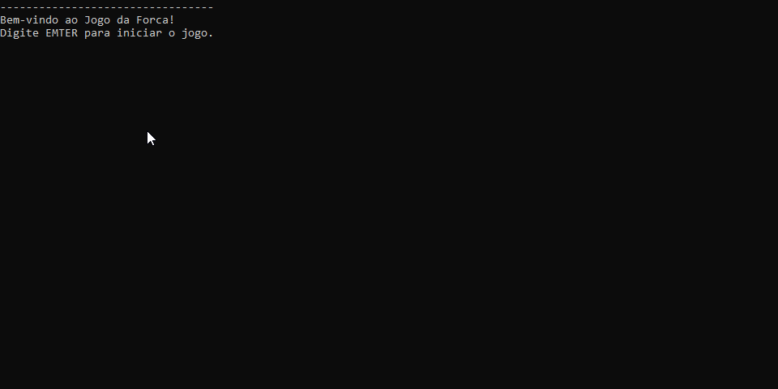

# JOGO DA FORCA



## Introdução

Este é um jogo da forca com tema de frutas. O programa selecionará aleatoriamente uma fruta, que deverá ser adivinhada em no máximo 5 tentativas. O usuário digitará uma letra a cada turno até vencer ou perder.
## Funcionalidades

- **Escolha uma palavra**: no início do jogo, uma palavra secreta aleatória é selecionada.

- **Representação da orca**: a orca é completada à medida que o jogador comete erros.

- **Visualização**: Em cada interação bem-sucedida, a letra digitada pelo usuário será atualizada se estiver correta; um contador poderá ser exibido caso a letra digitada esteja incorreta, com um contador de erros.

- **Jogar novamente**: Se você vencer ou usar todas as 5 tentativas e perder o jogo, a opção de jogar novamente será exibida no console para o usuário decidir.

## Como utilizar o programa 

1. Clone o repositório ou baixe o código comprimido em .zip.
2. Abra o emulador de terminal e navegue até a pasta raiz.
3. Utilize o comando abaixo para restaurar as dependências do projeto.

```
 dotnet restore
```
4. Em seguida compile e execute o projeto com o comando:
```
dotnet run --project JogoDaForca.ConsoleApp
```

# Requisitos
- .NET SDK 10